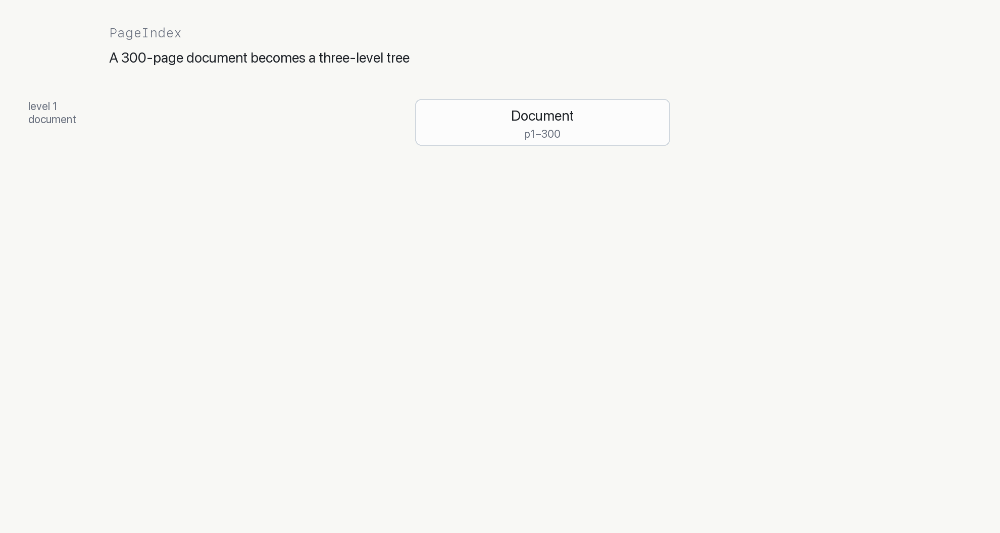
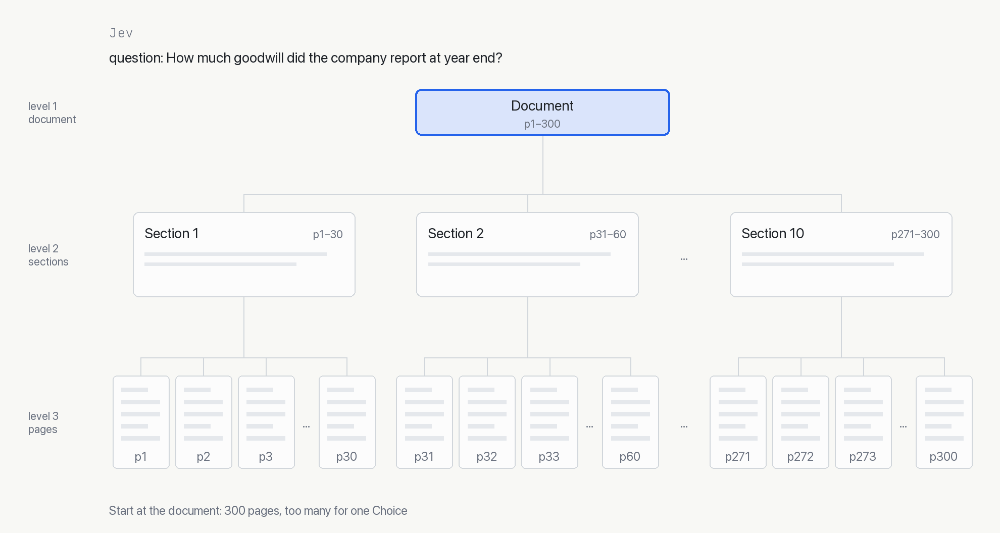

<picture>
  <source media="(prefers-color-scheme: dark)" srcset="assets/header-dark.png">
  
</picture>


**Find the page that answers a question in a 300-page report with Jev's `Choice`. No vector DB or embeddings!**

[Jev](https://docs.typesafe.ai) answers multiple-choice questions: give it the options, and it returns a probability for each. "Which page answers this question?" is one of them, and it works well, until the document outgrows what Jev can read at once. [PageIndex](https://github.com/VectifyAI/PageIndex) removes that limit by turning the document into a hierarchical tree representation. Jev picks a node, then one of its children, and so on down the tree, choosing among a handful of options each time, however long the document.

## Page search with Jev's `Choice`

Page search can be framed as a multiple-choice question. The question is "which page answers this?", and the options are the pages themselves: each page is one option, described by its own text. Jev reads every option and returns a probability for each page; the most likely page is the answer. We call this flat page search: one [`Choice`](https://docs.typesafe.ai/primitives/choice), one option per page.


To try it on a short PDF of your own, such as an employee handbook, run [page_search.py](page_search.py) (see [Setup](#setup) for installing and API keys):

```bash
python page_search.py handbook.pdf "How many vacation days do new employees get?"
```

It prints the most likely page and its text. The core of it is a single call:

```python
from pypdf import PdfReader
from typesafe_sdk import Choice, TypeSafeClient

typesafe = TypeSafeClient(model="jev-1.13.0")

pages = [page.extract_text() for page in PdfReader("handbook.pdf").pages]
question = "How many vacation days do new employees get?"

r = typesafe.system_one(
    state={"question": question},
    questions={"page": Choice(
        instructions="Which page contains the answer to the question?",
        criteria={f"p{i}": text for i, text in enumerate(pages, 1)},
    )},
)
print(r.answers["page"].choice)  # the most likely page, e.g. 'p7'
```

In the code:

- **`state`** is what Jev reads before deciding. Here it is just the question.
- **`Choice`** is the decision. Its options go in `criteria`: one key per page (`p1`, `p2`, …), each described by that page's text.
- **The answer** names the most likely page in `choice`, with every page's probability in `probabilities`, summing to 1.

### Why flat page search breaks on long documents

Flat page search hits two limits, one after the other:

1. **Too many tokens.** Every page's text goes into the request as an option, and `state` plus the `Choice` must fit in 32k tokens. That runs out after a few dozen pages. NVIDIA's [10-K for fiscal 2026](https://d18rn0p25nwr6d.cloudfront.net/CIK-0001045810/e361e58a-7483-44f5-bc62-a9080ae6ec72.pdf) has only 93 pages, but its text is about 76k tokens, more than twice what fits.
2. **Too many options.** A `Choice` takes at most 255 options, so one option per page stops at 255 pages. Some annual reports are longer than that: Citigroup's [10-K for 2025](https://www.citigroup.com/rcs/citigpa/storage/public/citi-2025-10-k-2-20-26.pdf) has 318 pages.

[PageIndex](https://github.com/VectifyAI/PageIndex) solves both at once. It turns the flat choice over pages into a tree: the document splits into sections, each with a title and a short summary, and each section into its pages. Jev then makes one small choice per level instead of one huge one, so every `Choice` has only a handful of options and fewer tokens.

## Tree search with PageIndex

### 1. Build the tree with PageIndex

PageIndex builds the tree from the document's own structure. The root is the whole document, its children are sections, and each section has a title, a summary, and a page range, down to the pages.



Submit the PDF and read its tree:

```python
import os

from pageindex import PageIndexClient

pageindex = PageIndexClient(api_key=os.environ["PAGEINDEX_API_KEY"])

doc_id = pageindex.submit_document("NVIDIA_10K.pdf", wait=True)["doc_id"]
tree = pageindex.get_document_structure(doc_id)
```

`tree` is a list of nodes, each with its `title`, its page range (`start_index` to `end_index`), a `summary` of those pages, and its children in `nodes`. For the NVIDIA 10-K it looks like this (abridged):

```jsonc
[
  // … 4 more
  {
    "title": "Item 1. Business",
    "node_id": "0004",
    "start_index": 4,
    "end_index": 12,
    "summary": "This section covers NVIDIA's overall business overview…",
    "nodes": [
      {
        "title": "Our Company",
        "node_id": "0005",
        "start_index": 4,
        "end_index": 5,
        "summary": "This text provides an overview of NVIDIA as a pioneer in…"
      }
      // … 16 more
    ]
  }
  // … 25 more
]
```

### 2. Search the tree with Jev

Jev starts at the root and asks one `Choice` per level: which of these children most likely contains the answer? Each option reads `"title. summary"`. The chosen section's children become the next menu, until the search reaches pages.



Continuing from the tree above, the search takes two steps.

**First, pick a section.** One `Choice` over the top-level sections, each described by its title and summary.

```python
from pageindex.utils import get_node
from typesafe_sdk import Choice, TypeSafeClient

typesafe = TypeSafeClient(model="jev-1.13.0")
question = "What was NVIDIA's total revenue for fiscal year 2026?"

sections = {n["node_id"]: f"{n['title']}. {n.get('summary', '')}" for n in tree}

r = typesafe.system_one(
    state={"question": question},
    questions={"section": Choice(
        instructions="Which section most likely contains the answer to the question?",
        criteria=sections,
    )},
)
section = get_node(tree, r.answers["section"].choice)  # the picked node_id, e.g. "0004"
```

**Then, pick a page inside it.** One `Choice` over the pages of that section, `start_index` to `end_index`, as in flat page search.

```python
pages = pageindex.get_page_content(doc_id, f"{section['start_index']}-{section['end_index']}")
r = typesafe.system_one(
    state={"question": question},
    questions={"page": Choice(
        instructions="Which page contains the answer to the question?",
        criteria={f"p{p['page_index']}": p["markdown"] for p in pages},
    )},
)
print(r.answers["page"].choice)  # the most likely page
```

This is a *simplified version* to show the idea; the next section covers the full tree search.

## The full tree search

The two-step search above is the simplest version. Going further, three changes make it general and sturdier: deeper trees, top-K search, and checking with `Noul`.

**Deeper trees.** A real tree has more than two levels: sections have subsections, which can have their own. The search is the same step repeated: one `Choice` over the children of the section just picked, until a section has no subsections, then one over its pages. Each level keeps the menu short, however long the document. The tree can go one level further, below pages: once a page is picked, one more `Choice` over its lines finds the exact line, as in TypeSafe's [line-by-line search](https://docs.typesafe.ai/cookbooks/semantic_find) cookbook.

**Top-K search.** Taking only the most likely option at each step is brittle: if the right section or page ranks second, it is lost. Instead, keep the top K: the K most likely keys of `probabilities`, not just `choice`. In the tree this is beam search: keep the K best paths at each level, scored by the geometric mean of their step probabilities, as in TypeSafe's [hierarchical classification](https://docs.typesafe.ai/cookbooks/hierarchical_classification) cookbook.

**Checking with `Noul`.** A `Choice` is relative: its probabilities sum to 1, so it always names a winner, even when no option answers the question. A [`Noul`](https://docs.typesafe.ai/primitives/noul) is a yes/no question with its own probability, so each candidate page can be judged on its own, with its full text in `state`, and kept or dropped by a threshold.

[tree_search.py](tree_search.py) puts all three together:

1. **Sections.** A beam of 3 goes down a tree of any depth. At each section, its opening pages, before its first subsection, are an option too.
2. **Pages.** One `Choice` over the pages of each of the 3 sections the beam ends in picks the candidates. A section too long for one request is split into windows that fit.
3. **Check.** One `Noul` per candidate, up to 16. Pages at 0.5 or above are kept, or the best 2 if none is.

Run it on a PDF and a question:

```bash
python tree_search.py NVIDIA_10K.pdf "What was NVIDIA's total revenue for fiscal year 2026?"
```

It uploads the PDF, builds the tree, prints its `doc_id`, then the sections the search ended in and the pages it kept. To ask another question about the same document, pass the `doc_id` instead of the PDF, so it is not uploaded again:

```bash
python tree_search.py pi-... "What was NVIDIA's gross margin for fiscal year 2026?"
```

On the two annual reports, uploaded to the cloud PageIndex:

| Question | Pages | Answer found on | Correct |
| --- | --- | --- | --- |
| What was NVIDIA's total revenue for fiscal year 2026? | 93 | p37, p51 | ✓ |
| What was Citigroup's net income for 2025? | 318 | p12, p16, p134, p135 | ✓ |

Both answers are right: they are the figures in each report's consolidated statement of income (NVIDIA p51, Citigroup p134).

## Setup

```bash
pip install -r requirements.txt
export TYPESAFE_API_KEY="..."
export PAGEINDEX_API_KEY="..."
```

You can get a TypeSafe key from the [TypeSafe console](https://console.typesafe.ai) and a PageIndex key from the [PageIndex dashboard](https://dash.pageindex.ai/).

## License

[Apache 2.0](LICENSE)
